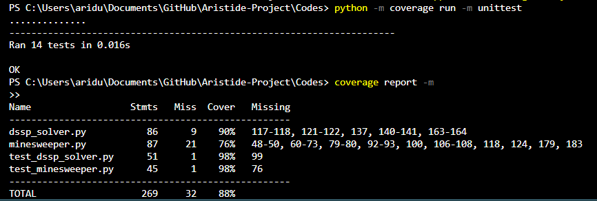
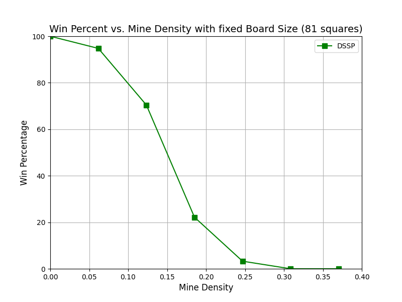

# The Testing Document

---

## **Coverage Report**

### Coverage of the tests :


The code has 100% coverage, it only loses percentages on methods linked to the user interface and with the main in the tests.

---

## What Has Been Tested and How?

### Tests Conducted:

1. **MinesweeperSolverDSSP**
   - Random selection of unrevealed and unflagged cells.
   - Checking conditions for "All Free Neighbor" and "All Marked Neighbor."
   - Solving the game with a predefined state to verify if the solver can win.
   - Handling scenarios where no steps are available.
   - Running games and checking the win rate.

2. **MinesweeperGame**
   - Generation of bomb locations.
   - Counting adjacent bombs accurately.
   - Correct identification of neighboring cells.
   - Revealing cells and placing/removing flags.
   - Winning conditions and game-over events.


### Method of Testing :
- Each test case uses assertions to validate expected outcomes against actual results.


### What kind of inputs were used for the testing ?

The tests for the Minesweeper game do not utilize inputs in the conventional sense. Instead, as seen in the implementation, each test function relies on a `MinesweeperGame` or `MinesweeperSolverDSSP` instance that is set up as an attribute during the `setUp` method. This instance is created with specific parameters (rows, columns, and bomb count) but does not require individual inputs for each test. Therefore, the tests operate directly on the state of the `MinesweeperGame` or the solver, allowing for focused validation of their functionalities without external inputs.

---

## **Running Tests with Coverage :**
Place yourself in .\Codes repository and :

- First execute the tests :
```bash
python -m coverage run -m unittest
```
- To Generate the report, run :
```bash
coverage report -m
```

--- 

## **DSSP Statistics:**

The algorithm played a total of 10,000 games for each difficulty level in the first two scenarios. It's important to note that games starting on a bomb were excluded from these counts, as such occurrences do not accurately reflect the solver's capabilities. In the third scenario, the algorithm played 1,000 games for each level of mine density. This testing approach ensures a robust evaluation of the solver's effectiveness in different game situations.

### DSSP Results: Starting with a Random Cell :
#### Beginner Level
- Win percentage for each batch: [67.56152125279642, 69.12599318955732, 68.29545454545455, 69.4760820045558, 67.95454545454545, 68.8430698739977, 68.24858757062147, 66.85845799769851, 69.18735891647856, 66.20370370370371]
- Global win percentage of DSSP: 68.18%

#### Intermediate Level
- Win percentage for each batch: [38.57988165680473, 38.780207134637514, 33.76318874560375, 36.7612293144208, 42.53554502369668, 38.497652582159624, 35.75757575757576, 33.95348837209302, 39.69010727056019, 39.90772779700115]
- Global win percentage of DSSP: 37.82%

#### Expert Level
- Win percentage for each batch: [0.8905852417302799, 0.7425742574257426, 1.2345679012345678, 0.9876543209876543, 1.8633540372670807, 0.6180469715698393, 0.49382716049382713, 1.0113780025284451, 0.7782101167315175, 1.1479591836734695]
- Global win percentage of DSSP: 0.98%

---
### DSSP Results: Starting with a Corner Cell
#### Beginner Level
- Win percentage for each batch: [72.74853801169591, 74.60850111856824, 73.9080459770115, 72.66435986159169, 71.51029748283753, 75.25539160045402, 73.73974208675264, 71.75660160734787, 73.77979568671964, 72.183908045977]
- Global win percentage of DSSP: 73.22%

#### Intermediate Level
- Win percentage for each batch: [38.795180722891565, 38.961038961038966, 41.66666666666667, 41.87725631768953, 40.0, 41.676234213547644, 41.408114558472555, 40.595238095238095, 41.73505275498242, 39.21568627450981]
- Global win percentage of DSSP: 40.59%

#### Expert Level
- Win percentage for each batch: [0.89171974522293, 1.8541409147095178, 1.3715710723192018, 1.015228426395939, 1.8726591760299627, 1.2437810945273633, 1.3480392156862746, 0.9962640099626401, 1.913265306122449, 1.608910891089109]
- Global win percentage of DSSP: 1.41%

---
### Win Percentage vs. Mine Density on a 9x9 grid
- Mine Density: 0.00, Win Percentage: 100.00%
- Mine Density: 0.06, Win Percentage: 95.93%
- Mine Density: 0.12, Win Percentage: 73.30%
- Mine Density: 0.19, Win Percentage: 24.60%
- Mine Density: 0.25, Win Percentage: 2.73%
- Mine Density: 0.31, Win Percentage: 0.29%
- Mine Density: 0.37, Win Percentage: 0.00%


